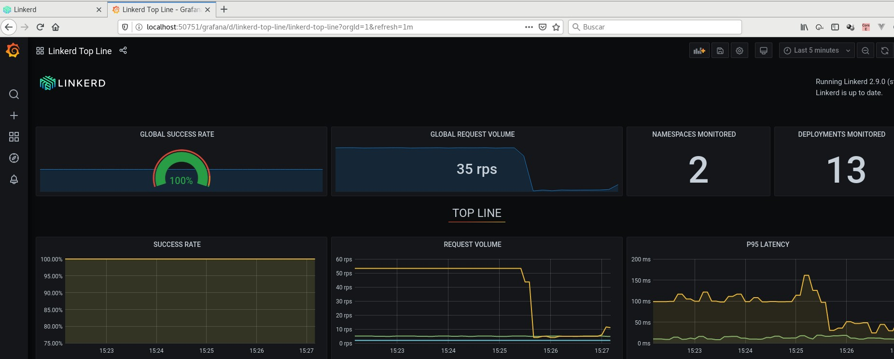
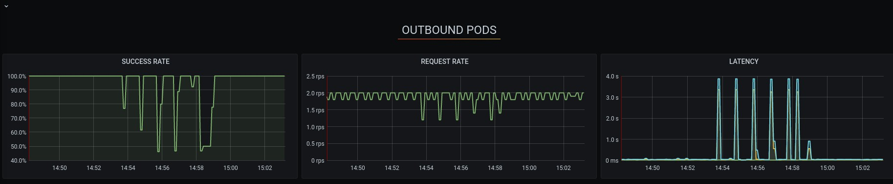
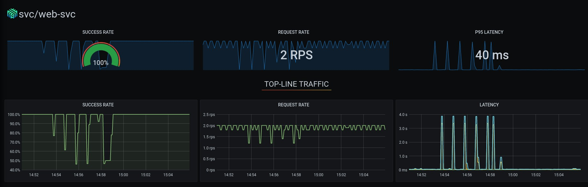
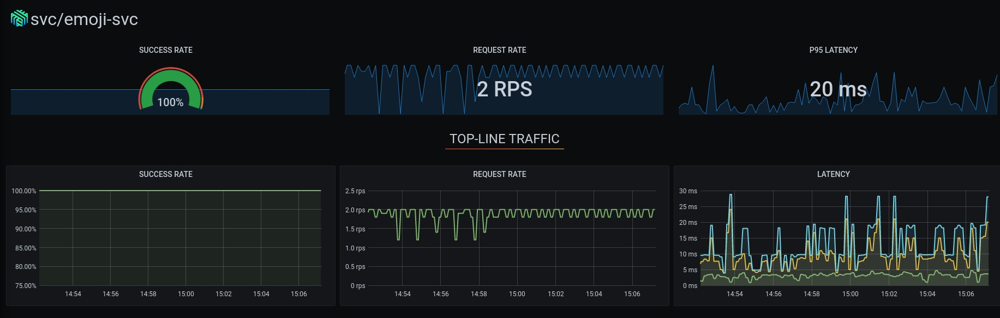
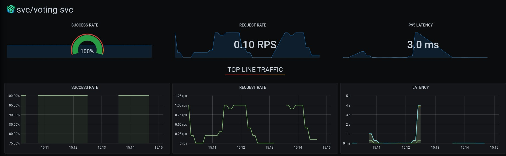
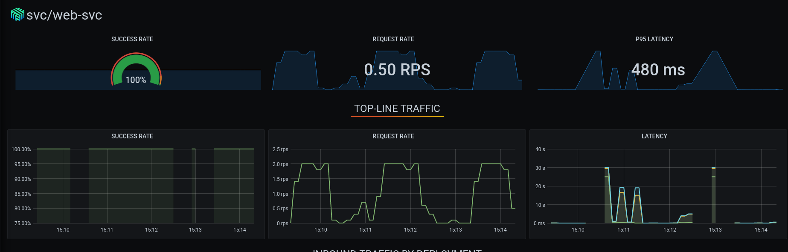
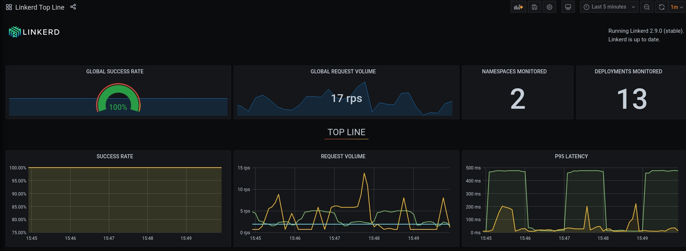

# Chaos experiments lab

Let's try some experiments.
In this folder you'll find two experiment files:

* _voting-pod-failure.yaml_: this will kill the voting-svc pod and will run for 30 second every minute.
* _web-network-loss.yaml_: this will force some network packet loss in the _web-svc_ service.

# Requirements

Before starting any experiment, you'll need to open _[linkerd](https://linkerd.io)_ and its _[grafana](https://grafana.com)_ dashboards.

``` bash
ζ linkerd dashboard                                                                                                                                                             [167f703] 
Linkerd dashboard available at:
http://localhost:50750
Grafana dashboard available at:
http://localhost:50750/grafana
Opening Linkerd dashboard in the default browser
```

Now you should see a dashboard like the one below:


``` bash
ζ linkerd dashboard --show grafana --port 50751                                                                                                                                                         [167f703] 
Linkerd dashboard available at:
http://localhost:50751
Grafana dashboard available at:
http://localhost:50751/grafana
Opening Grafana dashboard in the default browser
```

And this should show something similar to the picture below:




# Let's experiment!

## Voting pod failure

Now you'll force a pod failure for the voting-svc service.

``` bash
kubectl apply -f voting-pod-failure.yaml
```

This will force a pod failure for 30 seconds every minute. If you did not scale your deployments, after a few minutes you should see something similar to the picture below from the _vote-bot_ and _web-svc_ perspective:





The _emoji-svc_ won't show any weird behaviour because is not interacting with the _voting_ pods.



### Cleaning up our mess

Lets remove all the experiments before stepping forward to the next one.

``` bash
kubectl apply -f voting-pod-failure.yaml
```

After a few minutes all the services should return to their usual behaviour with no errors.

## Web pods network loss

Now force a network loss applying the command below:

``` bash
kubectl apply -f web-networt-loss.yaml
```

This will force a packet loss for the _web_ pods for 1 minute every 2 minutes. After a few minutes you should see something similar to the picture below from all the pods that interact with the _web_ pods:





Packet loss experiments may show some unsteady results, so let's try with a short latency.

### Cleaning up our packet loss experiment

Lets remove all the experiments before stepping forward to the next one.

``` bash
kubectl apply -f web-networt-loss.yaml
```

## Web pods network delay

Now force a network delay of 200ms applying the command below:

``` bash
kubectl apply -f web-networt-delay.yaml
```

This will force a delay of 200ms for each packet send or received on the _web_ pods for 1 minute every 2 minutes. After a few minutes you should see something similar to the picture below in the _top line_ dashboard:



### Cleaning up our packet loss experiment

Lets remove all the experiments before stepping forward to the next one.

``` bash
kubectl apply -f web-networt-delay.yaml
```

And... that's all folks!
