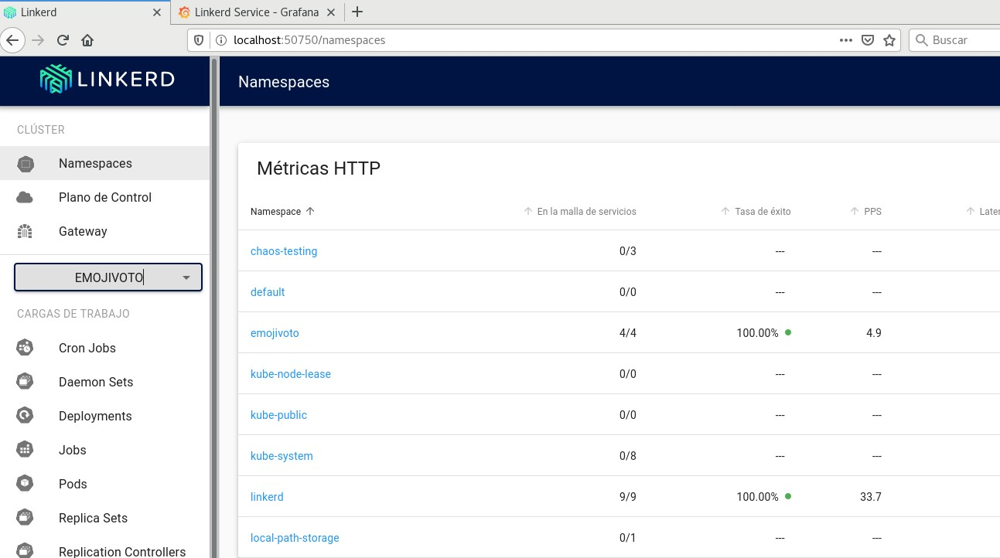

# Linkerd set up

## 1. Download linkerd binary

```
$ # Download linkerd binary.
$ wget -O /tmp/linkerd https://github.com/linkerd/linkerd2/releases/download/stable-2.9.0/linkerd2-cli-stable-2.9.0-linux-amd64
$ chmod +x /tmp/linkerd
$ sudo mv /tmp/linkerd /usr/local/bin
```

Moving the binary to _/usr/local/bin/_ is just for lazyness purposes ;)

## 2. Apply kubernetes manifests

```
$ linkerd check --pre
$ kubectl apply -f linkerd-install.yaml
```

## 3. Installing Emojivoto demo app

``` bash
$ kubectl apply -f emojivoto.yaml
```

## 4. Inject linkerd sidecars into emojivoto deployments

``` bash
$ kubectl get deployment -oyaml -n emojivoto | linkerd inject - | kubectl apply -f -
```

## 5. Open the linkerd dashboard

``` bash
$ linkerd dashboard
```

This should open a dashboardh like this one:


